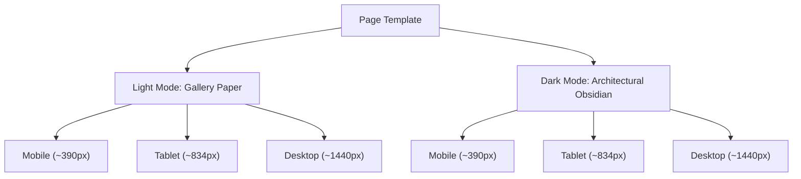

# SHOWCASE — Architecture & Implementation Master Plan

> **Product Vision**: Bring your product. Make it impossible to overlook.  
> **Core Duality**: **Explore** (interactive 3D exhibition & animated web sections) + **Create** (browser-based 3D product staging, material tuning, and high-fidelity export).  
> **Target Audience**: Ecommerce brands, Shopify merchants, creative agencies, 3D artists, and frontend developers.

---

## 1. Visual Art Direction & Color System

### 1.1 Non-AI Aesthetic Rules (Strict Guidance)
In direct accordance with the project brief and the `frontend-design` skill:
* **NO generic purple gradients or neon glowing blobs.**
* **NO generic SaaS card kit** (no repetitive 3-column cards with identical soft grey shadows).
* **NO fake client logos, fabricated testimonials, or generic marketing jargon.**
* **NO checkerboard patterns** or rectangular white box product cutouts.
* **YES to Architectural Precision & Editorial Gravitas**:
  * Inspired by high-end gallery catalogues (Swiss modernist grid, razor-thin 1px structural hairline rules).
  * Generous, intentional negative space framing large, tangible product compositions.
  * Tactile instrument feel: monospaced coordinate readouts, camera telemetry, and tactile physical toggles.
  * True transparent product cutouts paired with physical contact shadows and authentic PBR lighting.

### 1.2 Color Architecture & Palette (Individually Designed Modes)

The design system enforces high dynamic range and pristine legibility without relying on artificial electric glows:

| Role | Light Mode (Gallery Paper) | Dark Mode (Architectural Obsidian) | Usage |
| :--- | :--- | :--- | :--- |
| **Canvas Background** | `#F7F7F8` (Warm Calibrated Bone) | `#0C0D0E` (Deep Architectural Off-Black) | Base viewport & page foundation |
| **Surface Containers** | `#FFFFFF` (Pristine White) | `#141618` / `#1B1E22` (Tiered Obsidian) | Structural panels, editor inspector, exhibition mounts |
| **High Elevated Surface**| `#F0F0F2` | `#22252A` | Floating HUD pills, camera controls, tooltips |
| **Primary Typography** | `#111214` (Near Pitch Black) | `#F4F4F5` (Titanium White) | Headlines, active values, high-contrast labels |
| **Secondary Typography** | `#64666E` (Muted Slate) | `#A1A1AA` (Alabaster Grey) | Body text, telemetry descriptors, subtitles |
| **Hairline Dividers** | `rgba(0, 0, 0, 0.08)` | `rgba(255, 255, 255, 0.08)` | 1px perimeter guides and spatial grids |
| **Active Accent (Kinetic)** | `#0D9488` (Deep Forest Jade) | `#10B981` (Electric Emerald) | Active viewport controls, live status, camera anchors |
| **Luxury Accent (Editorial)** | `#B48C28` (Warm Antique Brass) | `#D4AF37` (Champagne Gold) | Jewelry indexing, featured materials, luxury tags |

### 1.3 Typographic System
* **Display & Headline Matrix**: **Hanken Grotesk** — tight tracking (`-0.02em` to `-0.04em`), disciplined optical weight, editorial proportions.
* **Technical & HUD Matrix**: **JetBrains Mono** — telemetry readouts, WebGL 3D coordinates, geometry vertices, camera angles, and property inputs.

---

## 2. Comprehensive Site Architecture & 25 Required Routes

Every route is treated as an individual, connected screen template rather than a generic card or single-page anchor.

```
/ (Home: Dual Explore & Create Gateway)
├── /showcase (Showcase Catalog)
│   ├── /showcase/[category] (Dynamic Category Landing)
│   ├── /showcase/shoe-experience (Flagship Sneaker Interactive Demo)
│   ├── /showcase/ring-experience (Intimate Jewelry & Gemstone Demo)
│   └── /showcase/scroll-product-reveal (Scroll-Driven Interactive Section)
├── /scenes (Scene Template Library)
│   └── /scenes/[slug] (Scene Specification & Live Stage)
├── /create (Creation Hub & Workflow Onboarding)
├── /editor (Browser-Based 3D Studio)
│   ├── /editor/new (Dropzone, Environment Picker & Upload)
│   ├── /editor/[project-id] (Complete Multi-Panel Editing Workspace)
│   ├── /editor/[project-id]/model-check (Validation Diagnostics & Repair Guide)
│   └── /editor/[project-id]/export (Image Rendering & Web Preview Studio)
├── /projects (Saved User Projects & Project Dashboard)
├── /pricing (Transparent Tier Comparison & FAQs)
├── /about (Independent Creator Story & Studio Philosophy)
├── /contact (Dual-Path Project Inquiry & Support Form)
├── /blog (Editorial 3D & Ecommerce Journal)
│   └── /blog/[slug] (In-Depth Technical Article: GLB Optimization)
├── /guides (Step-by-Step Practical Learning Hub)
│   └── /guides/[slug] (Comprehensive Guide: Model Orientation & UVs)
├── /help (Categorized Technical Support & Knowledge Base)
├── /auth (Sign-In & Account Creation Flow)
├── /privacy (Data Policy & 3D Model Retention Notice)
├── /terms (Service Terms & Asset License Definitions)
├── /licenses (Commercial & Template Asset Usage Rights)
└── /404 (Architectural Not-Found with Clear Re-routing)
```

---

## 3. Responsive & Theming Matrix (6 Views per Page)

Every page template is engineered across all 6 specified view permutations:



### Layout Specifications:
1. **Desktop (~1440px)**:
   * 12-column modular grid with 32px gutters and 48px outer margins.
   * Full-bleed interactive WebGL stages flanked by floating HUD clusters or docking sidebars.
2. **Tablet (~834px)**:
   * 8-column layout with 24px gutters.
   * Viewports remain primary; secondary inspector controls fold into collapsible split sheets or slide-over trays.
3. **Mobile (~390px)**:
   * Single-column flow with 16px margins.
   * 3D stage anchors upper 55-60vh of viewport; bottom safe area houses tactile pill selectors, preventing UI from obscuring the 3D model.

---

## 4. 3D Engine & Asset Pipeline Specification

### 4.1 Asset Rules
* Genuine transparent cutouts (transparent WebP/PNG) with cast shadows for static representations.
* Real GLTF/GLB models with DRACO compression for interactive stages.
* Explicit fallback state for WebGL failures or low-power devices (high-res WebP capture + retry CTA).

### 4.2 Featured 3D Showcase Experiences
1. **Sneaker Experience (`/showcase/shoe-experience`)**:
   * Multi-material mesh part targeting: Upper (mesh/leather), Midsole (foam), Outsole (rubber), Swoosh/Accent, Laces.
   * Camera hotkeys: 3/4 Perspective, Lateral Profile, Top Down, Heel Close-Up.
   * PBR properties: Roughness, Metalness, Normal mapping, Bump intensity.
2. **Luxury Ring Experience (`/showcase/ring-experience`)**:
   * Metal alloy selection: 18k Yellow Gold, Rose Gold, Platinum, White Gold.
   * Gemstone refraction & dispersion: Diamond, Emerald, Sapphire, Ruby.
   * Macro zoom mode and studio jewelry environment HDRI reflections.
3. **Scroll-Driven Website Reveal (`/showcase/scroll-product-reveal`)**:
   * Scrubbable scroll sequence demonstrating product disassembly and camera orbit synced with document scroll progress.

---

## 5. Editor Studio Specification (`/editor/[project-id]`)

Built on the architecture proven by creative tooling like Spline, Blender Lite, and the Shoe Texture Lab:

```
+----------------------------------------------------------------------------------+
| Top Bar: Project Title • Status [Saved] • Camera Presets • Theme • Export CTA     |
+--------------------------+-----------------------------------+--------------------+
| LEFT: Scene & Assets     | CENTER: 3D Stage                  | RIGHT: Inspector   |
| • Environment presets    | • Full-bleed WebGL Canvas         | • Transform        |
| • Lighting presets       | • OrbitControls (Pan/Rotate/Zoom) | • Material Editor  |
| • Studio floors/shadows  | • Selected part wireframe overlay | • Colorway Picker  |
| • Uploaded models        | • Telemetry HUD (XYZ, FPS, Poly)  | • Roughness/Metal  |
|                          | • Floating Camera Pills           | • Texture map slot |
+--------------------------+-----------------------------------+--------------------+
| Collapsible Bottom Strip: Camera Angles & Quick Reveal Animations                 |
+----------------------------------------------------------------------------------+
```

* **Model Validation Overlay (`/model-check`)**:
  * Scans poly count, file size, bounding box dimensions, missing texture maps, and UV channel completeness.
* **Export Studio (`/export`)**:
  * Instant WebP/PNG snapshot generation with customizable resolution (1x, 2x, 4x), aspect ratio (1:1, 4:5, 16:9), and background transparency toggle.
  * Interactive Web Preview configuration (embed code, iframe snippet, and shareable preview link).

---

## 6. Implementation & Delivery Batches

To ensure comprehensive quality across all 25 routes, 6 responsive views, and both themes, work is organized into structured batches:

### **Batch 1: Core Design System & Public Flagships**
* **Tokens & Utilities**: Global CSS variables, typography matrix, hairline border system, theme provider (system / light / dark).
* **Components**: Global Navigation (Desktop + Mobile drawer), Footer, Viewport HUD, Pill Controls.
* **Pages**:
  1. `/` (Home)
  2. `/showcase` (Showcase Catalog)
  3. `/showcase/[category]` (Category Template)
  4. `/showcase/shoe-experience` (Flagship 3D Sneaker Experience)
  5. `/showcase/ring-experience` (Flagship 3D Jewelry Experience)

### **Batch 2: Templates, Scroll Animation & Creation Pipeline**
* **Pages**:
  6. `/showcase/scroll-product-reveal` (Interactive Scroll Reveal)
  7. `/scenes` (Scene Template Library)
  8. `/scenes/[slug]` (Scene Detail: Dark Spotlight, Clean Studio, etc.)
  9. `/create` (Creation Hub & Workflow Selector)
  10. `/editor/new` (Model Upload Dropzone & Initializer)

### **Batch 3: Full 3D Editor Studio & Project Management**
* **Pages**:
  11. `/editor/[project-id]` (Complete Multi-Panel 3D Editor)
  12. `/editor/[project-id]/model-check` (Model Validation & Health Checker)
  13. `/editor/[project-id]/export` (Image Render & Interactive Web Preview)
  14. `/projects` (User Project Dashboard & Recent Files)

### **Batch 4: Editorial, Community, Learning & Support**
* **Pages**:
  15. `/pricing` (Transparent Plans & Capabilities Matrix)
  16. `/about` (Independent Creator & Studio Mission)
  17. `/contact` (Dual-Channel Inquiries & Custom Project Form)
  18. `/blog` (Editorial Article Index)
  19. `/blog/[slug]` (Technical Case Study / Guide)
  20. `/guides` (Task-Oriented Learning Center)
  21. `/guides/[slug]` (Step-by-Step GLB Guide)
  22. `/help` (Technical FAQs & Troubleshooting Hub)

### **Batch 5: Authentication, Legal Policies & System States**
* **Pages**:
  23. `/auth` (Sign-in / Register Modal & Page)
  24. `/privacy`, `/terms`, `/licenses` (Legal Policies & Asset Rights)
  25. `/not-found` (404 Error Screen with Spatial Redirection)
* **Final Polish**: State validations (Loading, Error, Saving, Saved, Drag-over, Offline fallback), accessibility pass, and keyboard focus rings.
